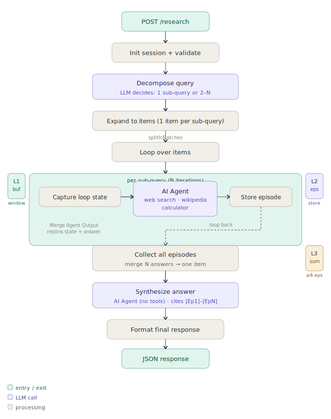
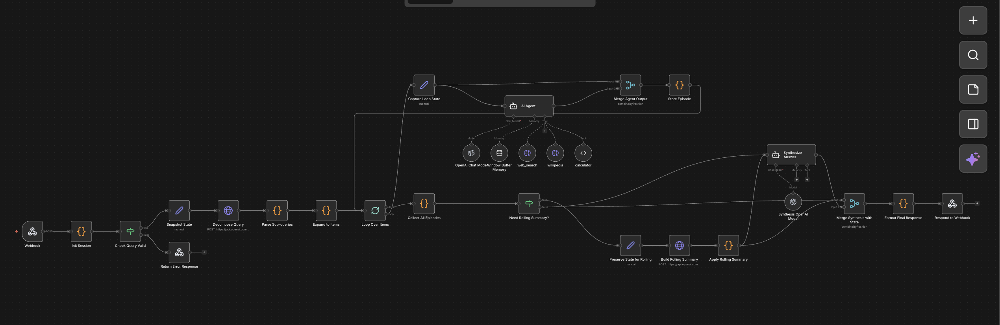

# Deep Research Agent

A memory-constrained research agent that answers complex queries by decomposing them into sub-questions, researching each independently, and synthesising a cited final answer. Built as an n8n workflow with a Python reference implementation and a full E2E test suite.



---

## Table of Contents

1. [Overview](#overview)
2. [Self-Defined Constraints](#self-defined-constraints)
3. [Memory Architecture](#memory-architecture)
4. [Workflow Architecture](#workflow-architecture)
5. [Project Structure](#project-structure)
6. [Quick Start](#quick-start)
7. [API Reference](#api-reference)
8. [Tools](#tools)
9. [Running the Test Suite](#running-the-test-suite)
10. [Design Decisions](#design-decisions)

---

## Overview

The agent receives a natural-language query via a webhook, decides whether to decompose it into sub-questions (handled by the LLM — no hard-coded rules), researches each sub-question using web search, Wikipedia, and a calculator, then synthesises all sub-answers into a coherent final response with inline citations `[Ep1]`, `[Ep2]`, etc.

**Key properties:**
- LLM-driven decomposition — simple queries run in a single pass; complex queries spawn 2–6 sub-questions
- Memory-bounded — episodic store grows linearly; rolling summary compression triggers at ≥ 6 episodes
- Tool-resilient — Wikipedia 404s and DuckDuckGo failures are caught and fallen back to gracefully
- Zero third-party Python dependencies in the test suite — runs on bare Python 3.8+

---

## Self-Defined Constraints

| Constraint | Value | Where enforced |
|---|---|---|
| Session token budget | 10,000 tokens | `Init Session` code node |
| Per-call context cap | 2,000 chars injected memory | `Capture Loop State` set node |
| Max sub-queries | 4 (configurable per request) | `max_sub_queries` payload field |
| Rolling summary threshold | ≥ 6 episodes | `Store Episode` code node |
| Working memory window | 4 turns | `Window Buffer Memory` node |
| Compression model | `gpt-4o-mini` | `Decompose Query` HTTP node |
| Research model | `gpt-4o-mini` | `OpenAI Chat Model` node |

---

## Memory Architecture

Three layers operate simultaneously during a research session.

**Layer 1 — Window Buffer Memory** (working memory)  
A 4-turn conversation buffer managed by n8n's LangChain `memoryBufferWindow` node. Scoped per agent call — the AI Agent sees the last 4 tool-use turns from its own current sub-query. Discarded after each episode is stored.

**Layer 2 — Episodic Store** (medium-term memory)  
A structured array of episode objects, each containing `id`, `query`, and `answer`. Threaded through Code nodes via item fields. The last 3 episodes (capped at 2,000 chars) are injected as context into each agent call via the `episodesContext` field in `Capture Loop State`. Grows linearly with the number of sub-queries.

**Layer 3 — Rolling Summary** (long-term compression)  
When episode count reaches the threshold (≥ 6), all current episodes are compressed into a single narrative string by a dedicated `gpt-4o-mini` call. The compressed summary replaces the full episodes array, bounding memory growth for long sessions. The summary is injected into subsequent agent calls as `[Session Summary]`.

---

## Workflow Architecture



**Critical design notes:**

Two `Merge` nodes solve the AI Agent's state-drop problem. The LangChain AI Agent node outputs only `{output: "..."}` and drops all input item fields. `Merge Agent Output` (inside the loop) and `Merge Synthesis with State` (after synthesis) use `combineByPosition` to rejoin the dropped state with the agent's answer before downstream code nodes read it.

`splitInBatches` is the only supported loop primitive in n8n. Because n8n's execution engine does not support cycles (a node cannot be re-entered after it has already run in the same execution), the loop is structured by pre-expanding sub-queries into N separate items — one per sub-query — before the batch node. `splitInBatches` emits them one at a time and loops back to itself correctly.

---

## Project Structure

```
deep-research-agent/
├── n8n_workflow/
│   └── deep-research-agent.json   n8n importable workflow
├── tests/
│   └── test_n8n_workflow.py                       unit + integration tests
|                     n8n E2E test harness (3-layer evaluation)
├── docs/
│   ├── evaluation.md                       architecture trade-offs + empirical results
│   └── architecture.svg                    workflow diagram
└── README.md
```

---

## Quick Start

### n8n workflow

1. Import `n8n_workflow/deep-research-agent.json` into your n8n instance
2. Add your OpenAI credential — search for `"OpenAI account"` in the workflow and connect it to `Decompose Query`, `AI Agent`, and `Synthesis AI Agent`
3. Click **Activate** in the top-right
4. Send a POST request to the webhook URL:

```bash
curl -X POST https://your-instance.n8n.cloud/webhook/research \
  -H "Content-Type: application/json" \
  -d '{"query": "Compare RAG vs fine-tuning for LLM specialisation", "max_sub_queries": 4}'
```

---

## API Reference

### Request

```json
{
  "query": "string — the research question",
  "max_sub_queries": 4
}
```

### Response

```json
{
  "answer": "Full synthesised answer with [Ep1], [Ep2] citations",
  "sub_queries": ["sub-question 1", "sub-question 2", "..."],
  "episodes": [
    {
      "id": 1,
      "query": "sub-question 1",
      "answer": "agent answer with tool citations"
    }
  ],
  "rolling_summary": "LLM-compressed narrative (non-empty only when ≥6 episodes ran)",
  "token_usage": {
    "consumed": 1922,
    "limit": 10000,
    "remaining": 8078,
    "utilization_pct": 19.2,
    "calls": [
      {"step": "sub_query_1", "tokens": 412},
      {"step": "sub_query_2", "tokens": 361}
    ]
  },
  "memory_strategy": "hierarchical_episodic_3layer",
  "success": true
}
```

### Error response (HTTP 400)

```json
{
  "error": "Missing or empty query parameter",
  "message": "Please provide a valid 'query' field in the request body",
  "example": {"query": "What is quantum computing?", "max_sub_queries": 3}
}
```

---

## Tools

The AI Agent has access to three tools. All run without API keys.

| Tool | Endpoint | Purpose |
|---|---|---|
| `web_search` | DuckDuckGo Instant Answer API | Current facts, news, recent events |
| `wikipedia` | Wikipedia REST v1 `/page/summary/{title}` | Reference summaries for established concepts |
| `calculator` | JS `Function()` safe eval | Arithmetic and mathematical expressions |

---

## Running the Test Suite

### n8n E2E tests (recommended)

Tests the live workflow directly via HTTP. No dependencies beyond Python 3.8+.

```bash
export N8N_WEBHOOK_URL="https://your-instance.n8n.cloud/webhook/research"
export OPENAI_API_KEY="sk-..."   # enables LLM-as-judge scoring

# All 9 tests
python test_n8n_workflow.py

# Skip LLM judge (faster, no OpenAI calls)
python test_n8n_workflow.py --no-judge

# Single test
python test_n8n_workflow.py --test rolling_summary_trigger

# By category
python test_n8n_workflow.py --category edge_case
```

Results are written to `test_outputs/`:
- `test_run_<ts>.json` — raw responses + all check results
- `evaluation_section_<ts>.md` — ready to append to `docs/evaluation.md`

```bash
cat test_outputs/evaluation_section_*.md >> docs/evaluation.md
```

### Test cases

| id | Category | What it verifies |
|---|---|---|
| `simple_definition` | simple | LLM returns 1 sub-query for "What is ML?" |
| `simple_concept` | simple | Consistent single-pass on a second simple query |
| `comparison_rag_finetuning` | comparison | Both topics cited, [Ep1]–[EpN] present |
| `comparison_sql_nosql` | comparison | Cross-domain generalisation |
| `multi_part_gradient` | multi_part | Sequential IDs, chained sub-answers |
| `token_budget_check` | edge_case | 4-part query stays under 10,000 tokens |
| `rolling_summary_trigger` | edge_case | 6 sub-queries → `rolling_summary` non-empty |
| `budget_exhaustion` | edge_case | 500-token budget → partial answer, no crash |
| `empty_query` | error_handling | HTTP 400, no crash |

### Evaluation layers

1. **Structural checks** — field presence, sequential episode IDs, token budget compliance, citation presence
2. **Golden test set** — keyword coverage scoring against `must_cover` lists; both sides present for comparison queries
3. **LLM-as-judge** — GPT-4o-mini scores faithfulness, completeness, and coherence (0–10) with per-test criteria and minimum thresholds

---

## Design Decisions

See `docs/evaluation.md` for full trade-off analysis. Key decisions:

**LLM-driven decomposition** — the decomposition prompt instructs the LLM to return `["original query"]` for simple questions and 2–N sub-questions for complex ones. This avoids hard-coded word-count heuristics and correctly handles edge cases like short-but-complex queries ("Compare RAG vs fine-tuning" — 5 words, but genuinely needs decomposition).

**`splitInBatches` as the loop primitive** — n8n does not support cycles; an IF node visited twice in the same execution is short-circuited. The only correct loop pattern is `splitInBatches`, which is designed to be re-entered. Sub-queries are pre-expanded into N separate items by the `Expand to Items` Code node before reaching the batch node.

**Merge nodes for state preservation** — the LangChain AI Agent node outputs only `{output: "...text..."}` and drops all input fields. Two Merge nodes (`combineByPosition`) are used to rejoin dropped state: `Merge Agent Output` inside the loop (reunites `Capture Loop State` fields with the agent answer before `Store Episode`), and `Merge Synthesis with State` after synthesis (reunites `Collect All Episodes` state with the synthesis answer before `Format Final Response`).
